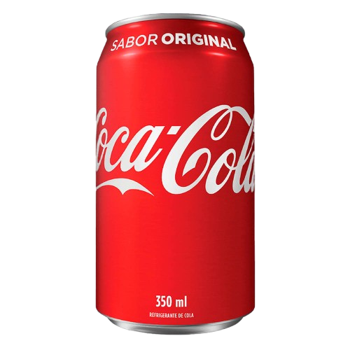

# 🥤 Site Institucional Coca-Cola

<p align="center">
  
</p>

<p align="center">
  <strong>Projeto Front-End inspirado na identidade visual da Coca-Cola, desenvolvido com foco em design moderno, responsividade e experiência do usuário.</strong>
</p>

---

## 🚀 Sobre o Projeto

O **Site Institucional Coca-Cola** é um projeto desenvolvido para praticar conceitos essenciais de desenvolvimento Front-End através da criação de uma landing page moderna inspirada na marca Coca‑Cola.

A aplicação apresenta uma interface visualmente atrativa, organizada e responsiva, simulando um site institucional de apresentação da marca e seus produtos.

Durante o desenvolvimento, foram aplicados conceitos importantes como:

* ✅ Estruturação semântica com HTML5
* ✅ Estilização moderna com CSS3
* ✅ Responsividade para diferentes dispositivos
* ✅ Organização de arquivos e componentes
* ✅ Navegação intuitiva
* ✅ Boas práticas de desenvolvimento Front-End

O projeto também demonstra atenção ao design e experiência do usuário, pontos importantes para construção de portfólio profissional.

---

## 🛠️ Tecnologias Utilizadas

<div align="left">

* 🌐 HTML5
* 🎨 CSS3
* ⚡ JavaScript
* 📱 Responsividade
* 💻 Estruturação Semântica

</div>

---

## ✨ Funcionalidades

* 🥤 Página institucional inspirada na Coca-Cola
* 📱 Layout responsivo
* 🎯 Navegação simples e intuitiva
* 🖼️ Exibição visual de produtos
* ⚡ Interface moderna e dinâmica
* 📂 Organização modular do CSS
* 💡 Estrutura preparada para futuras melhorias

---

## 📂 Estrutura de Pastas

```bash
📦 Site-Institucional-Coca-Cola-main
 ┣ 📂 css
 ┃ ┣ 📄 contatos.css
 ┃ ┣ 📄 estilo.css
 ┃ ┣ 📄 popup.css
 ┃ ┗ 📄 produtos.css
 ┣ 📂 img
 ┃ ┣ 📄 coca-cola-co.jpg
 ┃ ┣ 📄 coca-cola-logo-novo.jpg
 ┃ ┣ 📄 footer_back.png
 ┃ ┣ 📄 icone_cola.png
 ┃ ┣ 📄 instagram.jpg
 ┃ ┣ 📄 marcas_co.png
 ┃ ┣ 📄 rodape_logo.jpg
 ┃ ┣ 📄 sobre_nos-co.jpg
 ┃ ┣ 📄 whatsapp.jpg
 ┃ ┗ 📂 Produtos
 ┃   ┣ 📄 coca-cola-copa.png
 ┃   ┣ 📄 coca-cola-nome.png
 ┃   ┣ 📄 coca-cola.png
 ┃   ┣ 📄 garrafa crystal-2.png
 ┃   ┣ 📄 garrafa crystal-3.png
 ┃   ┣ 📄 garrafa crystal.png
 ┃   ┣ 📄 garrafa sprite-2.png
 ┃   ┣ 📄 garrafa sprite-3.png
 ┃   ┣ 📄 garrafa sprite.png
 ┃   ┣ 📄 lata fanta-cod.png
 ┃   ┣ 📄 lata fanta-fn.png
 ┃   ┣ 📄 lata fanta.png
 ┃   ┣ 📄 lata kuat-2.png
 ┃   ┣ 📄 lata kuat-dourada.png
 ┃   ┣ 📄 lata kuat.png
 ┃   ┣ 📄 suco kapo-2.png
 ┃   ┣ 📄 suco kapo-3.png
 ┃   ┗ 📄 suco kapo.png
 ┣ 📂 js
 ┃ ┗ 📄 form.js
 ┣ 📂 telas
 ┃ ┣ 📄 contatos.html
 ┃ ┣ 📄 pop_produtos.html
 ┃ ┗ 📄 produtos.html
 ┣ 📄 README.md
 ┗ 📄 index.html
```

### 🔧 Pré-requisitos

Você precisa apenas de:

* Um navegador atualizado
* Ou utilizar o VS Code com a extensão Live Server

---

### ▶️ Executando Localmente

```bash
# Clone o repositório
 git clone https://github.com/murilodemarco/Site-Institucional-Coca-Cola.git

# Acesse a pasta do projeto
 cd Site-Institucional-Coca-Cola
```

Depois disso:

* Abra o arquivo `index.html`

ou

* Execute utilizando o **Live Server** no VS Code.

---

## 🎯 Objetivo do Projeto

Este projeto foi desenvolvido com o objetivo de aprimorar habilidades em desenvolvimento Front-End, especialmente:

* Estruturação de páginas web
* Criação de layouts modernos
* Responsividade
* Organização de código
* Estilização com CSS3
* Interatividade com JavaScript
* Experiência do usuário (UX/UI)

Além disso, o projeto também funciona como peça de portfólio para demonstrar evolução prática no desenvolvimento web.

---

## 📚 Aprendizados Adquiridos

Durante o desenvolvimento deste projeto, foram reforçados conhecimentos importantes como:

* ✅ Organização de projetos Front-End
* ✅ Estruturação semântica
* ✅ Criação de layouts responsivos
* ✅ Manipulação de estilos com CSS
* ✅ Uso de JavaScript para interatividade
* ✅ Separação de responsabilidades no CSS
* ✅ Desenvolvimento de interfaces modernas
* ✅ Pensamento voltado para UX/UI

---

## 👨‍💻 Autor

Desenvolvido com dedicação e foco em evolução contínua no desenvolvimento Front-End. 🚀
